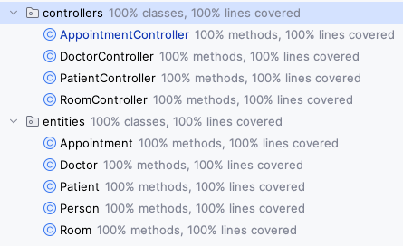
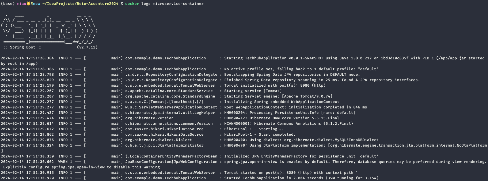
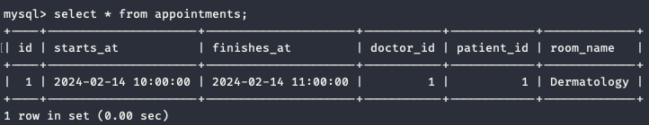
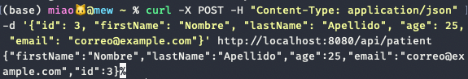

## Reto Accenture

---

### Tareas Realizadas
<br>

#### 1. Creación de citas (AppointmentController):

He desarrollado el método de 'createAppointment()' según lo especificado en el test de JUnit, comprobando que no se solape con ninguna cita existente.

#### 2. Pruebas unitarias de 'Entities' y 'Controllers':

He creado las pruebas unitarias JUnit para las entidades 'Appointment', 'Doctor', 'Patient', 'Room' y para los controladores de 'Doctor', 'Patient', 'Room'.
Todas las pruebas pasan con un **coverage del 100%**.



#### 3. Docker y Kubernetes:


He creado los Dockerfiles necesarios para ejecutar la base de datos MySQL y el microservicio. El Dockerfile Multistage ejecuta primero las pruebas; si todas pasan, se procede a compilar y ejecutar el microservicio. Los Dockerfiles asociados, Dockerfile.mysql y Dockerfile.maven, se encuentran en la raíz de la carpeta 'Reto-Accenture2024'.
Las credenciales necesarias para acceder a la base de datos, se encuentran en el archivo 'Dockerfile.mysql'.


#### 4. Diagramas UML:


He desarrollado un diagrama UML que representa todas las relaciones entre las clases del sistema y otro de la base de datos creada a partir del script 'init.sql' situado en la carpeta 'db-scripts'. Ambos se encuentran en la carpeta 'uml'. Además, todo el código escrito va acompañado de comentarios para proporcionar información sobre su funcionamiento a modo de documentación.

Para ejecutar el proyecto, seguí los siguientes pasos:

1. Construí la imagen de MySQL:

```docker build -t mysql-img -f Dockerfile.mysql .```

2. Ejecuté el contenedor de MySQL:

```docker run -d -p 3306:3306 --name mysql-container mysql-img```

3. Construí la imagen del microservicio

```docker build -t microservice-img -f Dockerfile.maven .```

4. Ejecuté el contenedor del microservicio:

```docker run -d -p 8080:8080 --name microservice-container --link mysql-container:mysql microservice-img```



Para acceder a la base de datos, a través de linea de comandos, puede hacerse ejecutando el siguiente comando:

```docker exec -it mysql-container mysql -uroot -proot accwe-hospital```



Para probar la API, podemos hacerlo con un comando 'curl' como el siguiente:

```curl -X POST -H "Content-Type: application/json" -d '{"id": 3, "firstName": "Nombre", "lastName": "Apellido", "age": 25, "email": "correo@example.com"}' http://localhost:8080/api/patient```

